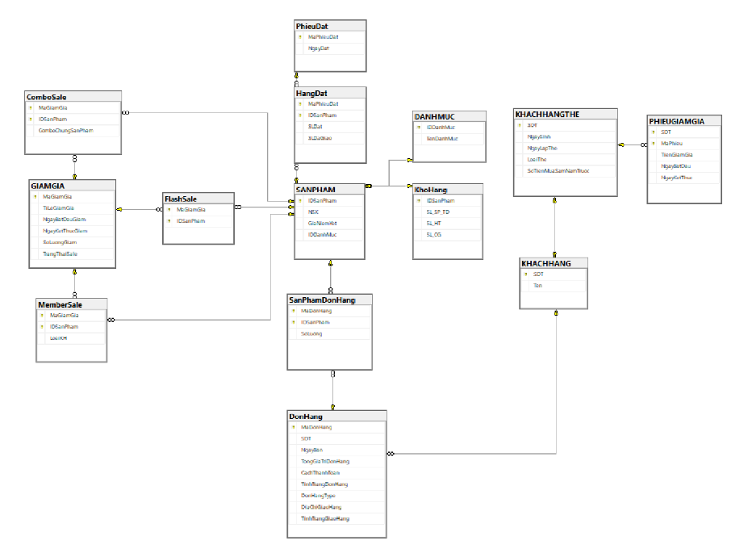

<!-- Hình nền đầu -->

  

---

# 🛒 Hệ Thống Thông Tin Siêu Thị  

## 📌 Giới Thiệu  
Đây là dự án môn học **Hệ Quản Trị Cơ Sở Dữ Liệu (DBMS)**, phát triển bằng **Microsoft SQL Server**.  
Mục tiêu là xây dựng hệ thống quản lý cho **Siêu thị ABC**, bao gồm **sản phẩm, khách hàng, chương trình khuyến mãi, đơn hàng và kho hàng** cho cả mua sắm **online** và **offline**.  

The project applies advanced database concepts such as:  
- ✅ Database normalization (1NF → 3NF)  
- ✅ Stored Procedures & Triggers for automation  
- ✅ Views & Indexes for query optimization  
- ✅ Role-based security & access control  

---

## 🏗️ Các Bộ Phận Trong Hệ Thống  

1. **Bộ phận Chăm Sóc Khách Hàng**  
   - Quản lý tài khoản khách hàng  
   - Phân loại khách hàng thân thiết và khách vãng lai  
   - Gửi phiếu giảm giá  

2. **Bộ phận Quản Lý Ngành Hàng**  
   - Quản lý thông tin sản phẩm  
   - Quản lý chương trình khuyến mãi (*Flash-sale, Combo-sale, Member-sale*)  

3. **Bộ phận Xử Lý Đơn Hàng**  
   - Xử lý đơn hàng từ khách hàng thân thiết và khách vãng lai  
   - Cập nhật trạng thái đơn hàng  

4. **Bộ phận Quản Lý Kho Hàng**  
   - Theo dõi số lượng tồn kho  
   - Tự động đặt hàng khi kho dưới ngưỡng  

5. **Bộ phận Kinh Doanh**  
   - Thống kê doanh thu  
   - Báo cáo số lượng bán hàng  

---

## 🗄️ Cơ Sở Dữ Liệu  

Hệ cơ sở dữ liệu quan hệ gồm các bảng chính:  

- **Khách hàng (Customers)**: Quản lý thông tin và phân hạng khách hàng  
- **Sản phẩm (Products)**: Thông tin sản phẩm, nhà sản xuất, giá  
- **Chương trình khuyến mãi (Promotions)**: Flash-sale, Combo-sale, Member-sale  
- **Đơn hàng (Orders)**: Đơn hàng của khách hàng  
- **Chi tiết đơn hàng (OrderDetails)**: Các sản phẩm trong mỗi đơn hàng  
- **Kho hàng (Inventory)**: Quản lý tồn kho và đặt hàng lại  
- **Nhà cung cấp (Suppliers)**: Thông tin nhà sản xuất và nhà cung cấp  

  

  

<em>Logical schema of the supermarket database</em>
  

---

## 🚀 Các Tính Năng Chính  

- **Quản Lý Khách Hàng**  
  - Tạo tài khoản khách hàng  
  - Phân loại khách hàng thân thiết  
  - Tự động gửi phiếu giảm giá  

- **Quản Lý Sản Phẩm & Ngành Hàng**  
  - Đăng ký sản phẩm mới  
  - Cập nhật giá và thông tin nhà sản xuất  
  - Theo dõi sản phẩm trong các chương trình khuyến mãi  

- **Quản Lý Chương Trình Khuyến Mãi**  
  - Flash-sale  
  - Combo-sale  
  - Member-sale  

- **Quản Lý Đơn Hàng**  
  - Tạo và quản lý đơn hàng  
  - Cập nhật trạng thái đơn hàng  

- **Quản Lý Kho Hàng**  
  - Theo dõi số lượng tồn kho  
  - Tự động đặt hàng khi kho thấp  

- **Báo Cáo & Phân Tích**  
  - Thống kê doanh thu  
  - Theo dõi số lượng bán hàng  

---

## 🛠️ Công Nghệ Sử Dụng  

- **Cơ sở dữ liệu**: Microsoft SQL Server  
- **Ngôn ngữ**: T-SQL (Transact-SQL)  
- **Công cụ**: SQL Server Management Studio (SSMS)  
- **Thiết kế DB**: ERD, chuẩn hóa (1NF → 3NF)  
- **Tối ưu hóa**: Views & Indexes  
- **Tự động hóa**: Stored Procedures & Triggers  
- **Bảo mật**: Role-based Access Control (RBAC)  
